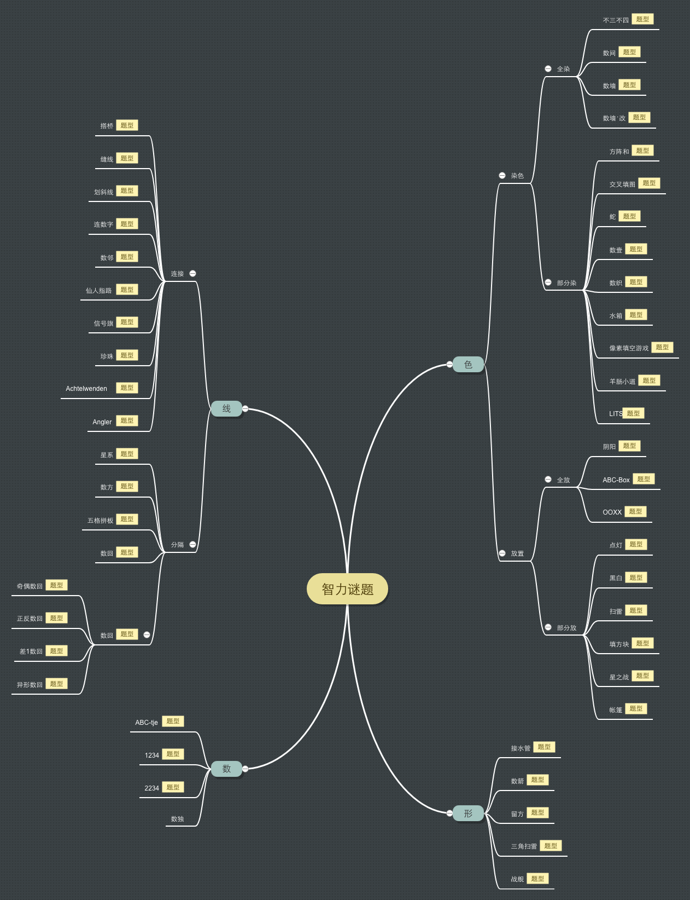

# Puzzle

收录谜题资源

## 查看方式

### GitHub

访问 [目录索引](SUMMARY.md)

### gitbook

访问: 
- [puzzle](https://zhugelianglongming.github.io/puzzle/)
- [智力游戏](https://zhugelianglongming.gitbook.io/zhi-li-you-xi/)

### 脑图
[智力谜题分类](http://naotu.baidu.com/file/2aaf3d54f319709cf717f5bd49d3dcae?token=b143a3231e27c705)

## 收录站点
- [搭桥](https://cn.puzzle-bridges.com/)
- [点灯](https://cn.puzzle-light-up.com/)
- [独·数之道](http://www.sudokufans.org.cn/)
- [黑白](https://cn.puzzle-binairo.com/)
- [方阵和](https://cn.puzzle-kakurasu.com/)
- [缝线](https://cn.puzzle-stitches.com/)
- [接水管](https://cn.puzzle-pipes.com/)
- [划斜线](https://cn.puzzle-slant.com/)
- [康思](https://www.conceptispuzzles.com/zh/index.aspx?uri=home)
- [留方](https://cn.puzzle-shakashaka.com/)
- [扫雷](https://cn.puzzle-minesweeper.com/)
- [数方](https://cn.puzzle-shikaku.com/)
- [数回](https://cn.puzzle-loop.com/)
- [数间](https://cn.puzzle-heyawake.com/)
- [数邻](https://cn.puzzle-dominosa.com/)
- [数墙](https://cn.puzzle-nurikabe.com/)
- [数墙‧改](https://cn.puzzle-tapa.com/)
- [数壹](https://cn.puzzle-hitori.com/)
- [数织](https://cn.puzzle-nonograms.com/)
- [水箱](https://cn.puzzle-aquarium.com/)
- [星系](https://cn.puzzle-galaxies.com/)
- [星之战](https://cn.puzzle-star-battle.com/)
- [信号旗](https://cn.puzzle-shingoki.com/)
- [帐篷](https://cn.puzzle-tents.com/)
- [战舰](https://cn.puzzle-battleships.com/)
- [珍珠](https://cn.puzzle-masyu.com/)
- [Logic Masters Deutschland e.V.](https://logic-masters.de/)
- [LITS](https://cn.puzzle-lits.com/)