# 谜题

<!-- markdownlint-disable MD013 -->

- [介绍](README.md)
- [主题索引](主题索引.md)
- [基本元素](https://www.bilibili.com/read/cv15279403)
- 分类
  - 色
    - 染色
      - 静态染
        - 双色
          - [Unruly](https://www.chiark.greenend.org.uk/~sgtatham/puzzles/js/unruly.html)
                      
          - [不三不四] 【需要登录】
                      
          - [数织](色/染色/双色/数织.md)
                      
          - [方阵和](https://cn.puzzle-kakurasu.com/)
          - [蛇](色/染色/双色/蛇.md)
                      
          - [数间](https://cn.puzzle-heyawake.com/)
          - [藕断丝连](色/染色/双色/藕断丝连.md)
                      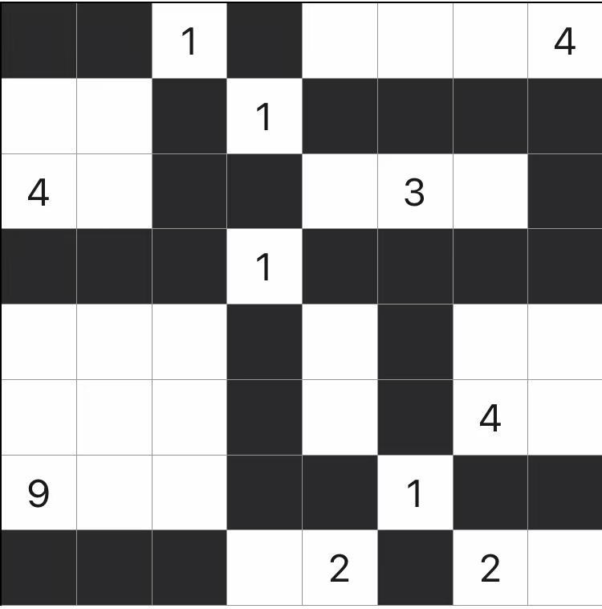
          - [数墙](色/染色/双色/数墙.md)
                      
          - [Aqre](https://www.gmpuzzles.com/blog/category/shading/aqre/)
                      
          - [Kurotto](https://www.gmpuzzles.com/blog/category/shading/kurotto/)
                      
          - [Nanro](https://www.gmpuzzles.com/blog/category/shading/nanro/)
                      
          - [Tapa](色/染色/双色/Tapa.md)
                      
          - [数壹](色/染色/双色/数壹.md)
                      
          - [水箱](https://cn.puzzle-aquarium.com/)
          - [马赛克](色/染色/双色/马赛克.md)
                      
          - [羊肠小道] 【需要登录】
          - [LITS](色/染色/双色/LITS.md)
                      
          - [Range](https://www.chiark.greenend.org.uk/~sgtatham/puzzles/js/range.html)
                      
          - [Cave](https://www.gmpuzzles.com/blog/category/regiondivision/cave/)
                      
          - [Kuromasu](https://www.gmpuzzles.com/blog/category/regiondivision/kuromasu/)
                      
        - 多色
          - [Map](https://www.chiark.greenend.org.uk/~sgtatham/puzzles/js/map.html)
                      
      - 动态染
        - [Cube](https://www.chiark.greenend.org.uk/~sgtatham/puzzles/js/cube.html)
                  
        - [Flip](https://www.chiark.greenend.org.uk/~sgtatham/puzzles/js/flip.html)
                  
        - [Flood](https://www.chiark.greenend.org.uk/~sgtatham/puzzles/js/flood.html)
                  
    - 放置
      - 全放
        - [阴阳](色/放置/全/阴阳.md)
                  
        - [ABC-Box](色/放置/全/ABC-Box.md)
        - [OOXX] 【付费】
      - 部分放
        - [点灯](色/放置/部分/点灯.md)
                  
        - [黑白](https://cn.puzzle-binairo.com/)
        - [扫雷](色/放置/部分/扫雷.md)
                  
        - [扫雷数独](色/放置/部分/扫雷数独.md)
        - [填方块] 【付费】
        - [星之战](色/放置/部分/星之战.md)
        - [帐篷](色/放置/部分/帐篷.md)
                  
        - [Black Box](https://www.chiark.greenend.org.uk/~sgtatham/puzzles/js/blackbox.html)
                  
        - [Magnets](https://www.chiark.greenend.org.uk/~sgtatham/puzzles/js/magnets.html)
                  
        - [Undead](https://www.chiark.greenend.org.uk/~sgtatham/puzzles/js/undead.html)
                  
      - 动态放
        - [Guess](https://www.chiark.greenend.org.uk/~sgtatham/puzzles/js/guess.html)
                  
    - 拾取
      - [Inertia](https://www.chiark.greenend.org.uk/~sgtatham/puzzles/js/inertia.html)
              
      - [Pegs](https://www.chiark.greenend.org.uk/~sgtatham/puzzles/js/pegs.html)
              
      - [Same Game](https://www.chiark.greenend.org.uk/~sgtatham/puzzles/js/samegame.html)
              
  - 线
    - 连接
      - [搭桥](线/连接/搭桥.md)
              
      - [缝线](https://cn.puzzle-stitches.com/)
      - [划斜线](线/连接/划斜线.md)
              
      - [连数字] 【付费】
      - [数邻](线/连接/数邻.md)
              
      - [仙人指路](线/连接/仙人指路.md)
              
      - [Castle Wall] 【题目有限】
              
      - [Masyu] 【题目有限】
              
      - [珍珠](线/连接/珍珠.md)
              
      - [信号旗](https://cn.puzzle-shingoki.com/)
      - [Balance Loop] 【题目有限】
              
      - [Achtelwenden](线/连接/Achtelwenden.md)
              
      - [Angler](线/连接/Angler.md)
              
      - [Signpost](https://www.chiark.greenend.org.uk/~sgtatham/puzzles/js/signpost.html)
              
      - [Tapa-Like Loop] 【题目有限】
              
      - [Round Trip] 【题目有限】
              
    - 分隔
      - [星系](线/分隔/星系.md)
              
      - [数方](线/分隔/数方.md)
              
      - [五格拼板](线/分隔/五格拼板.md)
              
      - [码牌](线/分隔/码牌.md)
              
      - [Araf](https://www.gmpuzzles.com/blog/category/regiondivision/araf/)
              
      - [Snake Pit](https://www.gmpuzzles.com/blog/category/regiondivision/snake-pit/)
              
      - [Pentominous](https://www.gmpuzzles.com/blog/category/regiondivision/pentominous/)
              
      - 数回
              
        - [数回](数回.md)
        - [奇偶数回](奇偶数回.md)
        - [正反数回](正反数回.md)
        - [差1数回](差1数回.md)
        - [异形数回] 【需要登录】
  - 形
    - [接水管](形/接水管.md)
          
    - [Netslide](https://www.chiark.greenend.org.uk/~sgtatham/puzzles/netslide-web.png)
          
    - [数箭](形/数箭.md)
          
    - [留方](形/留方.md)
          
    - [三角扫雷] 【需要登录】
          
    - [战舰](形/战舰.md)
          
    - [Statue Park] 【题目有限】
          
    - [Untangle](https://www.chiark.greenend.org.uk/~sgtatham/puzzles/js/untangle.html)
          
  - 数
    - 填
      - [ABC-tje](数/ABCtje.md)
      - [1234] 【需要登录】
              
      - [2234] 【需要登录】
              
      - [1to25](数/1to25.md) 
      - [1N+](数/1N+.md) 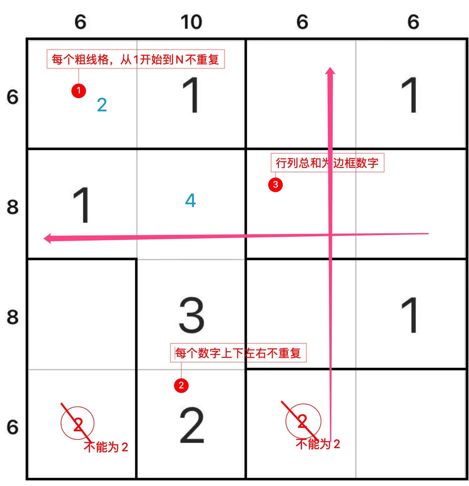
      - [划数字](数/划数字.md) 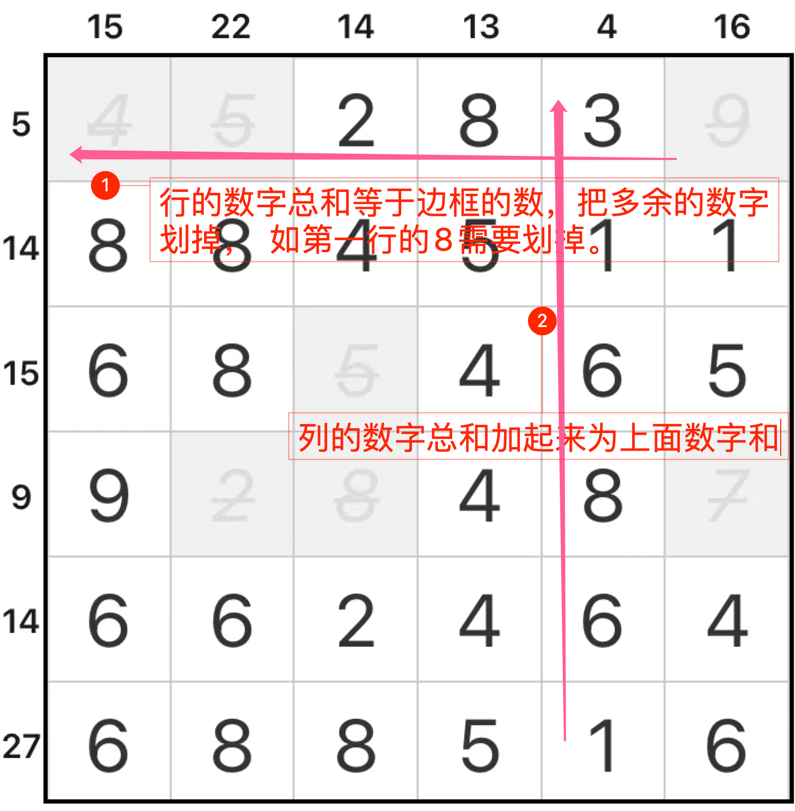
      - [方阵和](数/方阵和.md) 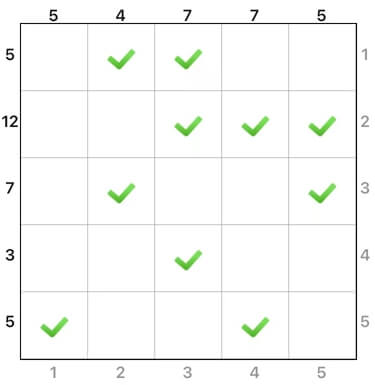
      - [数字块](数/数字块.md) 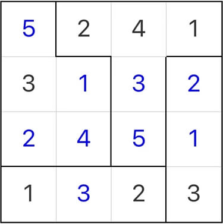
      - [高低块](数/高低块.md) 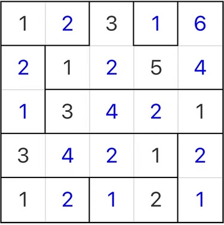
      - [无缘连数](数/无缘连数.md) 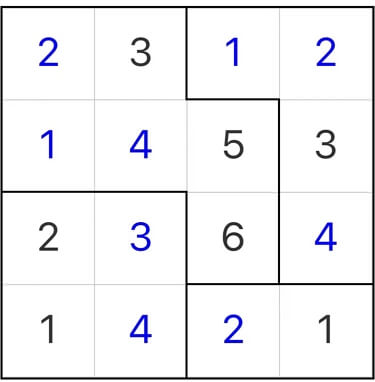
      - [四色定理](数/四色定理.md) 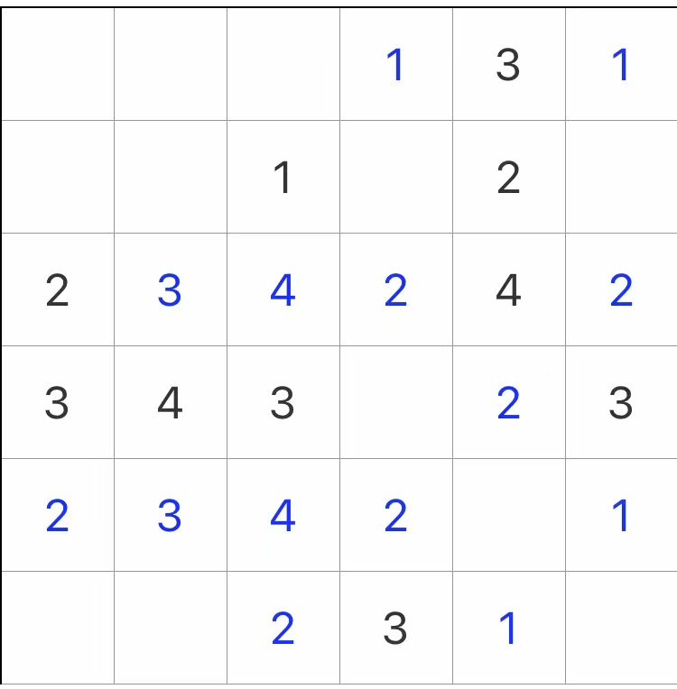
      - [因式推理](数/因式推理.md) 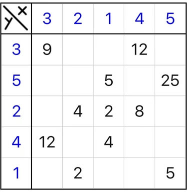
      - [无缘和网格](数/无缘和网格.md) 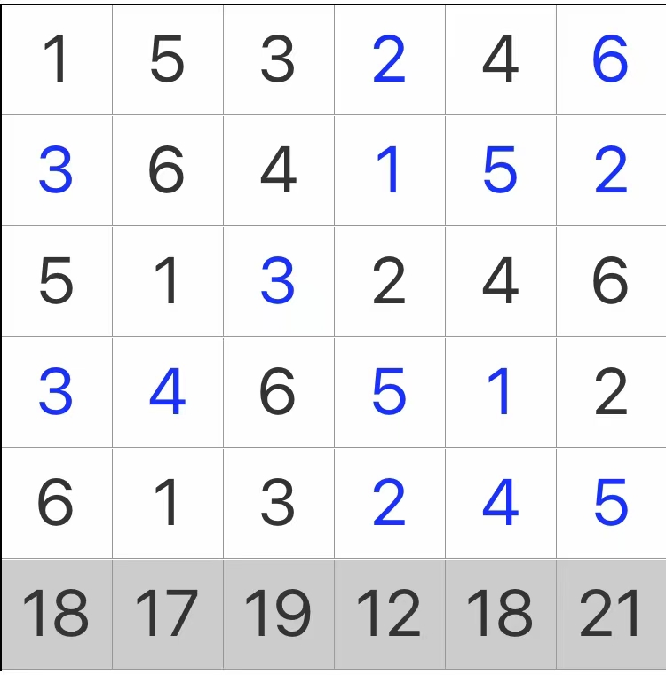
      - [连数字](数/连数字.md) 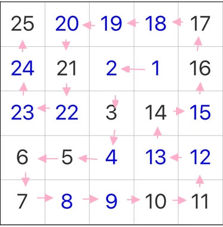
      - [连数字Pro](数/连数字Pro.md) 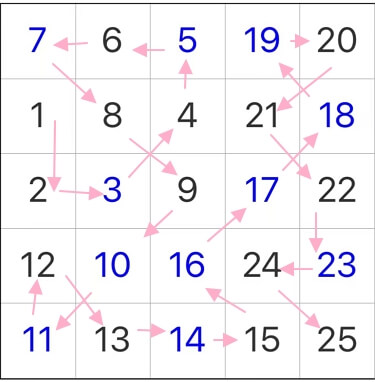
      - [数独](https://dwz.cn/sudoku)
    - 移
      - [Fifteen](https://www.chiark.greenend.org.uk/~sgtatham/puzzles/js/fifteen.html)
              
      - [Sixteen](https://www.chiark.greenend.org.uk/~sgtatham/puzzles/js/sixteen.html)
              
      - [Twiddle](https://www.chiark.greenend.org.uk/~sgtatham/puzzles/js/twiddle.html)
              

<!-- markdownlint-enable MD013 -->

## Obsidian

- [[数独]]

> [德国逻辑大师谜题分类](http://wiki.logic-masters.de/index.php?title=Kategorie:Systematik/de)

[Balance Loop]: https://www.gmpuzzles.com/blog/category/loop/balance-loop/

[Castle Wall]: https://www.gmpuzzles.com/blog/category/loop/castle-wall/

[Tapa-Like Loop]: https://www.gmpuzzles.com/blog/category/loop/tapa-like-loop/

[Round Trip]: https://www.gmpuzzles.com/blog/category/loop/round-trip/

[Statue Park]: https://www.gmpuzzles.com/blog/category/objectplacement/statue-park/

[Masyu]: https://www.gmpuzzles.com/blog/category/loop/masyu/

[不三不四]: http://www.sudokufans.org.cn/lx/n3.index.php?w=10

[1234]: http://www.sudokufans.org.cn/lx/game.index.php?type=1234

[2234]: http://www.sudokufans.org.cn/lx/game.index.php?type=2234

[羊肠小道]: http://www.sudokufans.org.cn/lx/sho.index.php?w=10

[异形数回]: http://www.sudokufans.org.cn/lx/loom.index.php?w=16&h=10

[三角扫雷]: http://www.sudokufans.org.cn/lx/ms.index.php?w=6

[OOXX]: https://www.conceptispuzzles.com/zh/index.aspx?uri=puzzle/tic-tac-logic

[填方块]: https://www.conceptispuzzles.com/zh/index.aspx?uri=puzzle/pic-a-pix

[连数字]: https://www.conceptispuzzles.com/zh/index.aspx?uri=puzzle/link-a-pix
