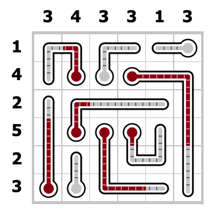

# 温度计

## 别名

- 温度计
- Thermometers

## 规则

### 解答方式

- 给温度计染色

### 限制

| 序号  |  限制区域   | 限制规则                         |
|:---:|:-------:|:-----------------------------|
|  1  |   温度计   | 温度计可以控制温度：通过从玻璃泡开始连续染色       |
|  2  | 提示数（盘外） | 提示数 `X`：表示当前行/列中，恰有`X`个格子被染色 |

### 标签

- [[染色]]

## 题库

- [温度计](https://cn.puzzle-thermometers.com/?size=7)
