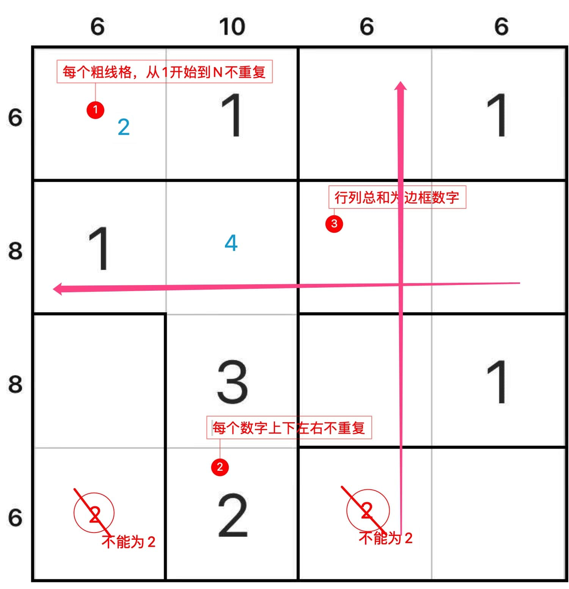

# 1N+

## 规则

### 解答方式

- 盘面填入数字

### 限制

| 序号  | 限制区域 | 限制规则                   |
|:---:|:----:|:-----------------------|
|  1  | 异形宫  | 每个大小为`N`的异形宫，需分别填入 1~N |
|  2  |  全盘  | 对于任意单元格，共边邻格的数字不能相同    |
|  3  |  盘外  | 提示数`S`：当前行/列的所有数字和为`S` |

### 标签

- [[数字]]

## 题库

### 微信小程序

- 三思数独
