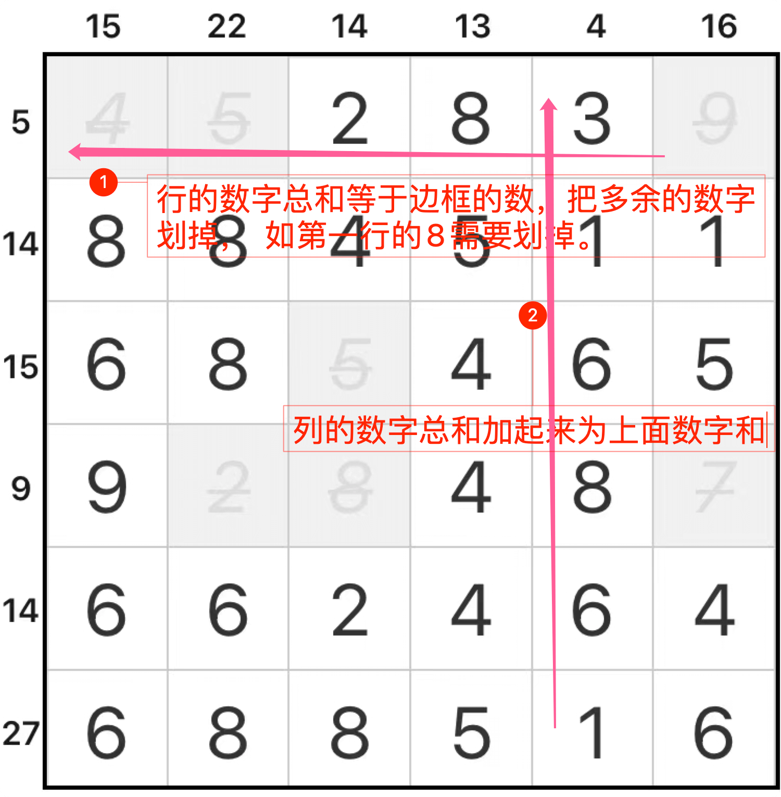

# 1N+

## 规则

### 解答方式

- 盘面删除部分数字

### 限制

| 序号  | 限制区域 | 限制规则                   |
|:---:|:----:|:-----------------------|
|  1  |  盘外  | 提示数`S`：当前行/列的保留数字和为`S` |

### 标签

- [[数字]]
- [[计算]]/加法

## 题库

### 微信小程序

- 三思数独
