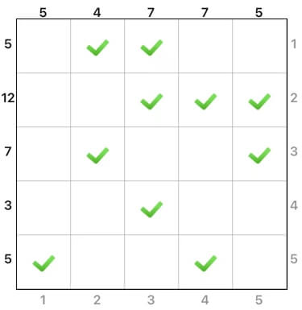

# 方阵和

## 规则

### 解答方式

- 通过勾选保留盘面部分单元格

### 限制

| 序号  |  限制区域  | 限制规则                                |
|:---:|:------:|:------------------------------------|
|  1  | 盘外（右下） | 提示数`W`：当前行/列的单元格权重为`W`              |
|  2  | 盘外（左）  | 提示数`S`：当前行的保留单元格权重和为`S`，权重为盘外（下）提示数 |
|  3  | 盘外（上）  | 提示数`S`：当前列的保留单元格权重和为`S`，权重为盘外（右）提示数 |

### 标签

- [[数字]]
- [[计算]]/加法
- [[计算]]/乘法

## 题库

### 微信小程序

- 三思数独
