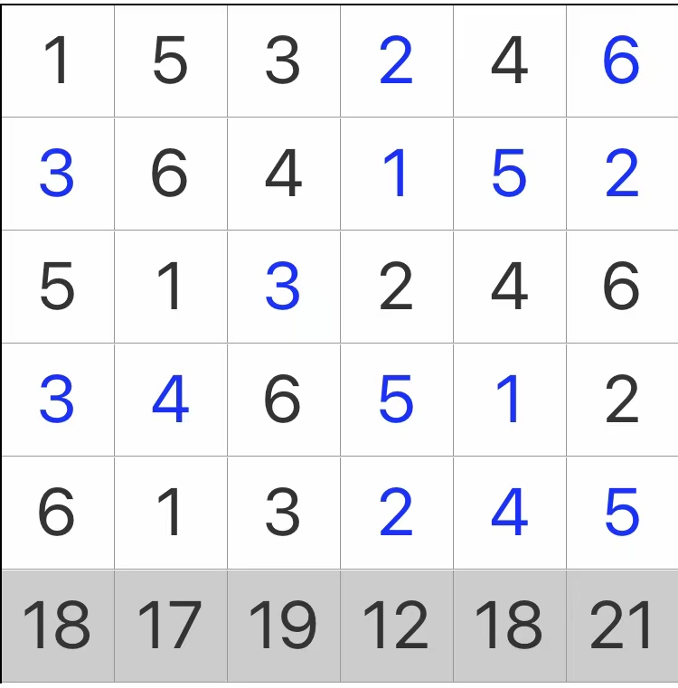

# 无缘和网格

## 规则

### 解答方式

- 盘面填入数字

### 限制

| 序号  | 限制区域  | 限制规则              |
|:---:|:-----:|:------------------|
|  1  |   行   | 1~9 不重复           |
|  2  |   列   | 填入 1~9            |
|  3  |  全盘   | 对于任意单元格，邻格的数字不能相同 |
|  4  | 盘外（下） | 提示数`S`表示：当前列数字的和  |

### 标签

- [[数字]]
- [[计算]]/加法

## 题库

### 微信小程序

- 三思数独
