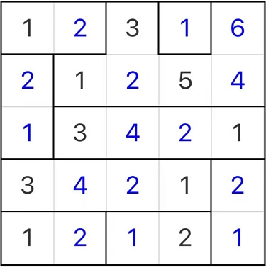

# 高地块

## 规则

### 解答方式

- 盘面填入数字

### 限制

| 序号  | 限制区域 | 限制规则                                        |
|:---:|:----:|:--------------------------------------------|
|  1  | 异形宫  | - 每个大小为`N`的异形宫，需分别填入 1~N - 异形宫同列中，上 > 下 |
|  2  |  全盘  | 对于任意单元格，邻格的数字不能相同                           |

### 标签

- [[数字]]
- [[计算]]/比大小

## 题库

### 微信小程序

- 三思数独
