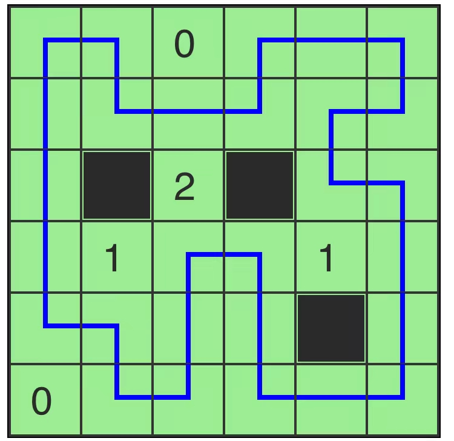

# 仙人带路

## 规则

### 解答方式

- 将**所有**白格标记为以下 2 种内容之一：
  - 黑格
  - 唯一回路的组成部分

### 限制

| 序号  | 限制区域 | 限制规则                          |
|:---:|:----:|:------------------------------|
|  1  |  全盘  | 任意 2 个黑格不共边                   |
|  2  | 提示数  | 提示数 `X`：当前格的共边邻格共有 `X` 个黑格    |
|  3  | 唯一回路 | - 经过所有白格  - 不经过黑格、提示格、占位格 |

### 标签

- [[连接]]

## 别名

- 仙人带路

## 题库

### 微信小程序

- 三思数独
