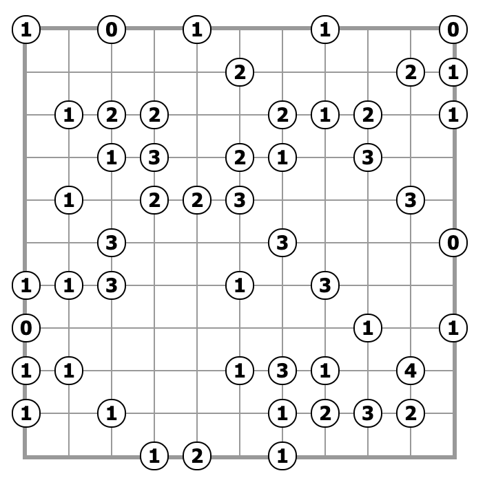
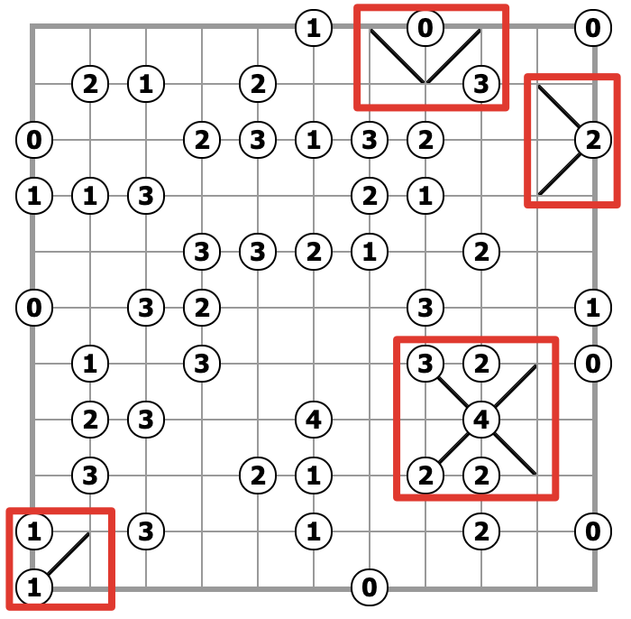
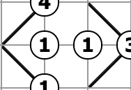
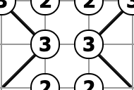
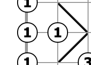
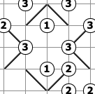

# 规则

## 解答方式

- 将**所有**格中划一条对角线，以下 2 种之一：
    - `／`
    - `＼`

## 限制

| 序号  |  限制区域   | 限制规则                     |    备注     |
|:---:|:-------:|:-------------------------|:---------:|
|  1  | 提示数（顶点） | 提示数`X`表示：有 X 条对角线连接到标记顶点 |           |
|  2  |   全盘    | 所有对角线不能连接成环              |           |

# 技巧

## 单提示数技巧

|   结构    | 结论                    |
|:-------:|:----------------------|
|   `0`   | 周围格的对角线，都不连接到提示顶点 `0` |
|   `4`   | 周围格的对角线，都连接到提示顶点 `4`  |
| 盘面顶角`1` | 周围格的对角线，连接到提示顶点 `1`   |
| 盘面边线`2` | 周围格的对角线，都连接到提示顶点 `2`  |

## 双提示数技巧

|      结构       | 结论                                                                         |                图例                 |
|:-------------:|:---------------------------------------------------------------------------|:---------------------------------:|
|   6 格`1-1`    | 边缘 4 格的对角线，都不连接到 2 个中心提示顶点`1`                                              |    |
|   6 格`3-3`    | 边缘 4 格的对角线，都连接到 2 个中心提示顶点`3`                                               |      |
|   4 格`1-1`    | 远离盘面边线的 2 格的对角线，都不连接到中心提示顶点`1`                                             |    |
| 12 格`3-1-3-1` | - `1`远离结构中心的 4 格的对角线，都不连接到中心提示顶点`1` - `3`远离结构中心的 4 格的对角线，都连接到中心提示顶点`3` |  |

# 别名
- 划斜线
- 斜线
- Gokigen Naname
- Slant

# 题库
- [划斜线](https://cn.puzzle-slant.com/)
- [Simon Tatham's Portable Puzzle Collection](https://www.chiark.greenend.org.uk/~sgtatham/puzzles/js/slant.html)

# Obsidian

[[连接]]
