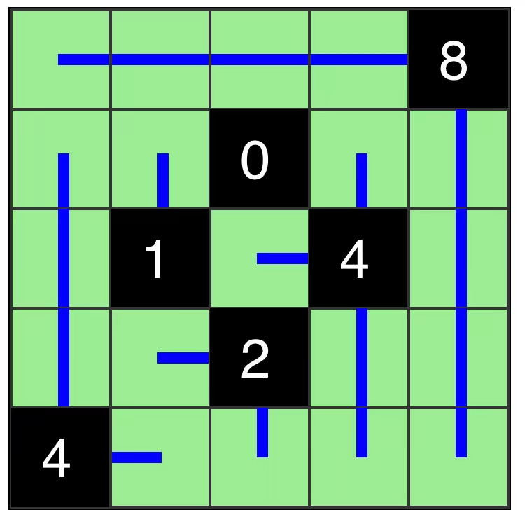

# 四风

## 规则

### 解答方式

- 从黑格绘制线段，覆盖全盘

### 限制

| 序号  | 限制区域 | 限制规则                              |
|:---:|:----:|:----------------------------------|
|  1  |  全盘  | 所有白格通过单方向线段，连接到 1 格黑格             |
|  2  | 提示数  | 提示数 `X`：从当前黑格延伸的线段（4 格防线）总长度为 `X` |
|  3  |  线段  | 不同线段之间：不相连、不交叉                    |

### 标签

- [[连接]]

## 别名

- 四风
- Four Winds

## 题库

### 微信小程序

- 三思数独
