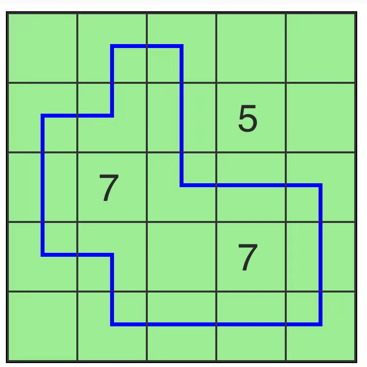

# 巡线器

## 规则

### 解答方式

- 在盘面绘制一条不交叉的闭合曲线

### 限制

| 序号  | 限制区域 | 限制规则                              |
|:---:|:----:|:----------------------------------|
|  1  | 提示数  | 提示数 `X`：表示当前格的邻格中，共有 `X` 格被闭合曲线通过 |
|  2  | 闭合曲线 | 闭合曲线不通过提示格                        |

### 标签

- [[连接]]

## 别名

- 巡线器

## 题库

### 在线网站

- [Tapa-Like Loop] 【题目有限】

### 微信小程序

- 三思数独

[Tapa-Like Loop]: https://www.gmpuzzles.com/blog/category/loop/tapa-like-loop/
