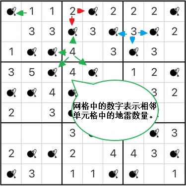

# 扫雷数独

## 规则

### 解答方式

- 将**部分**白格标记为`地雷`，并满足[限制](#限制)

### 限制

| 序号  |  限制区域   | 限制规则                       | 备注                          |
|:---:|:-------:|:---------------------------|-----------------------------|
|  1  | 提示数（盘内） | 提示数`X`表示：当前格的邻格中恰有 `X` 个地雷 |                             |
|  2  |  行/列/宫  | 每个行/列/宫中恰有`N`个地雷           | - 6 阶题：N=2   - 9 阶题：N=3 |

### 标签

- [[标记]]

## 题库

### 微信小程序

- 三思数独
