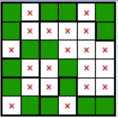

# 骨牌定位

## 别名

- 骨牌定位
- Norinori

## 规则

### 解答方式

- 通过染色，在盘面放置骨牌(1*2矩形)

### 限制

| 序号  | 限制区域 | 限制规则          |
|:---:|:----:|:--------------|
|  1  | 异形宫  | 每个异形宫恰有 2 格染色 |
|  2  |  骨牌  | 所有骨牌不可以有公共边   |

### 标签

- [[染色]]

## 题库

- [海苔](https://cn.puzzle-norinori.com/?size=9)
